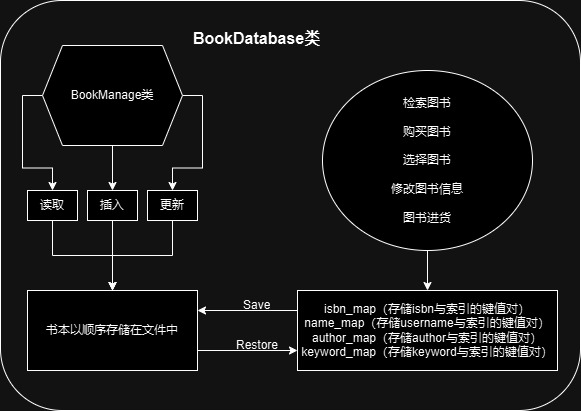
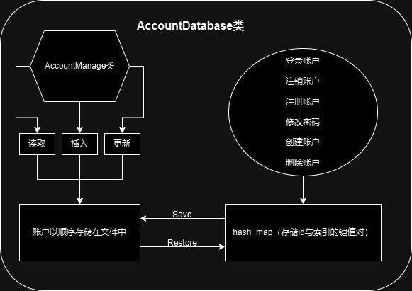
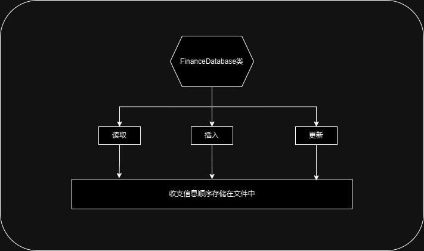
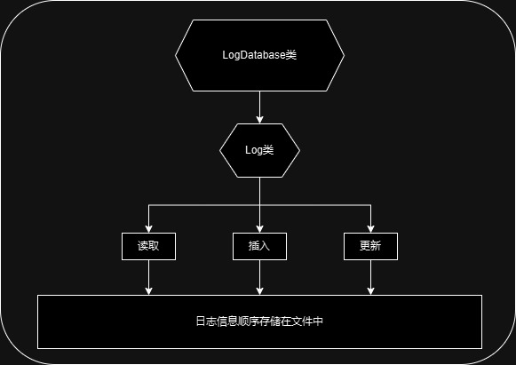

# Bookstore-2024 总体设计文档

- 作者： 丁宣铭 (konpaku_ming)

## 程序功能概述

实现一个模拟的书店管理系统，对该书店的用户、图书、日志信息进行管理。
#### 用户功能：
- 登录帐户
- 注销帐户
- 注册帐户
- 修改密码
- 创建帐户
- 删除帐户
#### 图书管理功能：
- 检索图书
- 购买图书
- 选择图书
- 修改图书信息
- 图书进货
#### 日志管理功能：
- 财务记录查询
- 生成财务记录报告指令
- 生成群体员工工作报告
- 生成日志

## 主体逻辑说明

将用户、图书封装成Account和Book类，建立AccounDatabase类对所有Account类进行管理，建立BookDatabase类对所有Book类进行管理。日志信息以FinanceDataBase和LogDatabase进行储存与管理。
主程序中整行读入指令，将指令分割成若干参数，根据参数信息调用对应的DataBase中的函数实现对用户、图书、日志的管理。

## 功能设计
#### 图书模块：
- 检索图书：做了五个函数分别对应`All`，`ISBN`，`BookName`，`Author`，`Keyword`，依据参数选择调用的函数。只有ISBN可以找到对应块再进行查找，其余函数都要遍历整个块链
- 购买图书：查询图书是否存在，若存在则检查权限和库存，可购买则修改库存，并将收入记录到`MyFinance`中
- 选择图书：查询图书是否存在，若存在则将`selected_book_idx`修改为对应图书的索引，若不存在则插入新书
- 修改图书信息：检查是否选中，已选中则根据索引取出对应图书。做了五个函数分别对应`ISBN`，`BookName`，`Author`，`Keyword`，`Price`，依据参数依次调用对应的函数
- 图书进货：检查是否选中，已选中则修改库存，并将支出记录到`MyFinance`中

#### 账户模块：
- 登录账户：查询账户是否存在，若账户存在且满足登录条件则将账户压入登录栈，修改`Myuser`中当前的权限
- 注销账户：若登录栈非空，弹出登录栈的头元素，修改`Myuser`中当前的权限
- 注册账户：查询id是否存在，若无则注册成功，在`unordered_map`中加入新索引
- 修改密码：查询id是否存在，若账户存在且满足修改条件则修改对应账户的密码
- 创建账户：基本与注册相同，多了对权限的检查
- 删除账户：查询id是否存在 + 查询id是否在登录栈中，若id存在且未登录，删除账户，在`unordered_map`中删除对应元素，销毁索引

#### 日志模块：
- 财务记录查询：检查`count`是否合法，若合法则遍历后`count`次财务记录，计算收支
- 生成财务报表：从头至尾遍历财务记录，输出操作者id、操作名和对应的收支情况
- 生成全体员工工作情况报告指令：从头至尾遍历操作记录，只输出权限为3的操作（即员工操作），输出用户id、操作名和该操作对应的收支情况。
- 生成日志：从头至尾遍历操作记录，输出用户id，操作名和对应收支情况。

收支：

工作日志：

## 代码文件结构（main函数与各个类的关系）

#### Book类（储存图书信息）
在`Book.h`中声明，在`Book.cpp`中定义
存放一本图书的所有信息
#### BookManage类（文件管理工具）
在`file_storage.h`中声明并定义
用文件`book_data`存储所有`Book`，实现最基础的读写功能
#### BookDatabase类（管理全部图书信息）
在`file_storage.h`中声明并定义
以块状链表的方式在外存中储存全部的图书信息
成员函数实现了图书系统要求实现的指令
即检索图书，购买图书，选择图书，修改图书信息和图书进货

#### Account类（储存用户信息）
在`Account.h`中声明，在`Account.cpp`中定义
存放一本图书的所有信息
#### AccountManage类（文件管理工具）
在`account_storage.h`中声明并定义
用文件`account_data`存储所有`Account`，实现最基础的读写功能
#### AccountDatabase类（管理全部账户信息）
在`account_storage.h`中声明并定义
在外存中储存全部的用户信息
以`unordered_map`存储用户id与账户索引的键值对
成员函数实现了用户系统要求实现的指令
即登录帐户，注销账户，注册账户，修改密码，创建账户和删除账户

#### FinanceDatabase类（储存用户信息）
在`log_storage.h`中声明并定义
在外存中存放全部的收入和支出信息
用于财务记录查询和生成财务记录报告

#### LogDatabase类（储存工作日志）
在`log_storage.h`中声明并定义
在外存中存放全部的工作日志信息
用于生成日志

#### main函数与各个类的关系
在main函数中创建`BookDatabase`类的`MyBook`作为图书信息库
在main函数中创建`AccountDatabase`类的`MyUser`作为用户信息库
在main函数中创建`FinanceDatabase`类的`MyFinance`作为财务信息库
在main函数中创建`LogDatabase`类的`MyLog`作为日志信息库
由main函数完成指令的输入与切块，依据切块所得参数调用各信息库中的函数，实现书店系统的管理

## 数据库设计
图书：以`Book`类封装图书信息，包括ISBN、BookName、Author、Keyword、库存、价格
将`BookDatabase`类作为图书数据库，在外存中以块状链表存储`Book`类，以ISBN字典序升序存储
存储以块状链表的方式实现，`Block`链表存放在内存中
退出系统时将`Block`链表备份到文件里，重启时读取文件，重新构建链表

账户：以`Account`类封装账户信息，包括UserId、Password、Username、Privilege
将`AccountDatabase`类作为账户信息库，在外存中以顺序存储`Account`类
在`unordered_map`中存储用户id与索引的键值对，便于查询
退出系统时会将`unordered_map`里的全部信息备份到文件中，重启时会将文件中的信息转移至`unordered_map`中

收支：将浮点型变量`double`写入到文件中，顺序储存，负数代表支出，正数代表收入
在查询财务记录时，访问后`count`次记录即可

日志：以`Log`封装日志信息，包括UserId、操作名、操作者权限、收支情况
将`LogDatabase`类作为日志信息库，在外存中顺序储存`Log`类

## 类、结构体设计：
`Book`类：封装图书信息
`BookManage`类：为了方便文件存储，封装了一些基本的文件操作，包括插入、修改、读取功能
`Block`结构体：存储最大ISBN与其中`Book`的索引，用于实现块状链表
`BookDatabase`类：图书信息库，提供所有对图书的操作
`Account`类：封装账户信息
`AccountManage`类：为了方便文件存储，封装了一些基本的文件操作，包括插入、修改、读取功能
`AccountDatabase`类：账户信息库，提供所有对账户的操作
`FinanceDatabase`类：收支信息库，功能为查询收支情况和生成收支报表
`Log`类：封装日志信息
`LogDatabase`类：日志信息库，功能为对全体员工工作情况生成报表