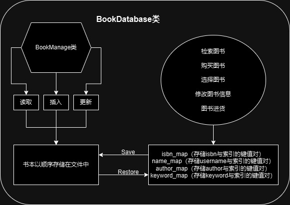
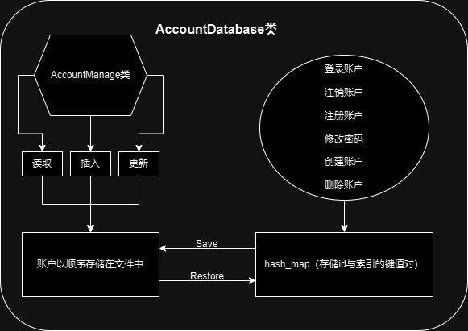
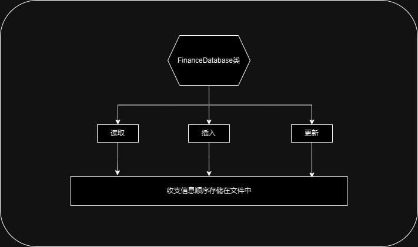
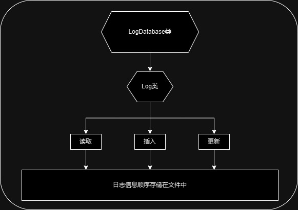

# Bookstore-2024 总体设计文档

- 作者： 丁宣铭 (konpaku_ming)

## 程序功能概述

实现一个模拟的书店管理系统，对该书店的用户、图书、日志信息进行管理。
#### 用户功能：
- 登录帐户
- 注销帐户
- 注册帐户
- 修改密码
- 创建帐户
- 删除帐户
#### 图书管理功能：
- 检索图书
- 购买图书
- 选择图书
- 修改图书信息
- 图书进货
#### 日志管理功能：
- 财务记录查询
- 生成财务记录报告指令
- 生成群体员工工作报告
- 生成日志

## 主体逻辑说明

将用户、图书封装成Account和Book类，建立AccounDatabase类对所有Account类进行管理，建立BookDatabase类对所有Book类进行管理。日志信息以FinanceDataBase和LogDatabase进行储存与管理。
主程序中整行读入指令，将指令分割成若干参数，根据参数信息调用对应的DataBase中的函数实现对用户、图书、日志的管理。

## 功能设计
#### 图书模块：
功能见上文

#### 账户模块：
功能见上文

#### 日志模块：
功能见上文

## 代码文件结构（main函数与各个类的关系）

#### Book类（储存图书信息）
在`Book.h`中声明，在`Book.cpp`中定义
存放一本图书的所有信息
#### BookManage类（文件管理工具）
在`file_storage.h`中声明并定义
用文件`book_data`存储所有`Book`，实现最基础的读写功能
#### BookDatabase类（管理全部图书信息）
在`file_storage.h`中声明并定义
以块状链表的方式在外存中储存全部的图书信息
成员函数实现了图书系统要求实现的指令
即检索图书，购买图书，选择图书，修改图书信息和图书进货

#### Account类（储存用户信息）
在`Account.h`中声明，在`Account.cpp`中定义
存放一本图书的所有信息
#### AccountManage类（文件管理工具）
在`account_storage.h`中声明并定义
用文件`account_data`存储所有`Account`，实现最基础的读写功能
#### AccountDatabase类（管理全部账户信息）
在`account_storage.h`中声明并定义
在外存中储存全部的用户信息
成员函数实现了用户系统要求实现的指令
即登录帐户，注册账户，修改密码，创建账户和删除账户

#### FinanceDatabase类（储存用户信息）
在`log_storage.h`中声明并定义
在外存中存放全部的收入和支出信息
用于财务记录查询和生成财务记录报告

#### LogDatabase类（储存工作日志）
在`log_storage.h`中声明并定义
在外存中存放全部的工作日志信息
用于生成日志

#### main函数与各个类的关系
在main函数中创建`BookDatabase`类的`MyBook`作为图书信息库
在main函数中创建`AccountDatabase`类的`MyUser`作为用户信息库
在main函数中创建`FinanceDatabase`类的`MyFinance`作为财务信息库
在main函数中创建`LogDatabase`类的`MyLog`作为日志信息库
由main函数完成指令的输入与切块，依据切块所得参数调用各信息库中的函数，实现书店系统的管理

## 数据库设计
图书：以`Book`类封装图书信息，包括ISBN、BookName、Author、Keyword、库存、价格
将`BookDatabase`类作为图书数据库，在外存中以块状链表存储`Book`类，以ISBN字典序升序存储

账户：以`Account`类封装账户信息，包括UserId、Password、Username、Privilege
将`AccountDatabase`类作为账户信息库，在外存中以顺序存储`Account`类

收支：将整型变量`int`写入到文件中，顺序储存，负数代表支出，正数代表收入

日志：以`Log`封装日志信息，包括UserId、操作名
将`LogDatabase`类作为日志信息库，在外存中顺序储存`Log`类

## 类、结构体设计：
`Book`类：封装图书信息
`BookManage`类：为了方便文件存储，封装了一些基本的文件操作，包括插入、修改、读取功能
`Block`结构体：存储最大ISBN，用于实现块状链表
`BookDatabase`类：图书信息库，提供所有对图书的操作
`Account`类：封装账户信息
`AccountManage`类：为了方便文件存储，封装了一些基本的文件操作，包括插入、修改、读取功能
`AccountDatabase`类：账户信息库，提供所有对账户的操作
`FinanceDatabase`类：收支信息库，功能为查询收支情况和生成收支报表
`LogDatabase`类：日志信息库，功能为对全体员工工作情况生成报表